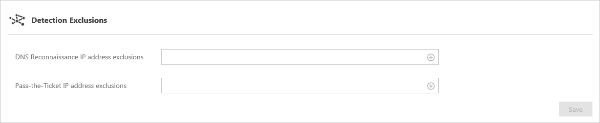

*Şunlar için geçerlidir: Advanced Threat Analytics sürüm 1.7*

# ATA’yı Yükleme - 6. Adım

>[!div class="step-by-step"]
[« 5. Adım](install-ata-step5.md)

## 6. Adım. IP adresi dışlamalarını ve Honeytoken kullanıcısını yapılandırma
ATA, belirli IP adreslerinin iki tür algılamadan dışlanmasını sağlar: **DNS Keşfi** ve **Anahtar Geçişi**. 

Örneğin, bir **DNS Keşfi dışlaması** DNS’i tarama mekanizması olarak kullanan bir güvenlik tarayıcısı olabilir. Bu dışlama işlemi ATA’nın böyle tarayıcıları yoksaymasına yardımcı olur. *Anahtar Geçişi* dışlama işlemine örnek olarak bir NAT aygıtı gösterilebilir.    

ATA ayrıca, kötü amaçlı aktörler için tuzak olarak kullanılan bir Honeytoken kullanıcısının yapılandırılmasına olanak tanır. Bu hesapla (normalde etkinliği yoktur) ilişkilendirilen herhangi bir kimlik doğrulaması bir uyarının tetiklenmesine neden olur.

Yukarıdakileri yapılandırmak için şu adımları izleyin:

1.  ATA Konsolu’ndan, ayarlar simgesine tıklayın ve **Yapılandırma**’yı seçin.

    

2.  **Algılama dışlamaları** altında, *DNS keşfi* veya *Anahtar Geçişi* için bir IP adresi girin ve *artı* işaretine tıklayın.

    

3.  **Algılama ayarları** altında Honeytoken hesap SID’lerini girin ve artı işaretine tıklayın. Örneğin: `S-1-5-21-72081277-1610778489-2625714895-10511`.

    

    > [!NOTE]
    > Bir kullanıcının SID’ini bulmak için, ATA Konsolu’nda kullanıcıyı arayın ve **Hesap Bilgileri** sekmesine tıklayın. 

4.  **Kaydet**'e tıklayın.

Tebrikler, Microsoft Advanced Threat Analytics dağıtımını başarıyla tamamladınız!

Algılanan kuşkulu etkinlikleri görüntülemek için saldırı zaman çizelgesini gözden geçirin ve kullanıcıları veya bilgisayarları arayın ve profillerini görüntüleyin.

ATA hemen şüpheli etkinlikler için tarama yapmaya başlar. ATA, davranış profilleri (en az üç haftalık) oluşturmak için zaman bulana kadar, bazı şüpheli davranış etkinlikleri gibi bazı etkinlikler kullanılamaz.

ATA’nın çalışır durumda olduğunu ve ağınızdaki ihlalleri yakalayıp yakalamadığını denetlemek için [ATA saldırı simülasyonu senaryo kitabına](https://docs.microsoft.com/enterprise-mobility-security/solutions/ata-attack-simulation-playbook) bakabilirsiniz.

>[!div class="step-by-step"]
[« 5. Adım](install-ata-step5.md)

## Ayrıca bkz.

- [ATA forumuna bakın!](https://social.technet.microsoft.com/Forums/security/home?forum=mata)
- [Olay koleksiyonunu yapılandırma](configure-event-collection.md)
- [ATA önkoşulları](/advanced-threat-analytics/plan-design/ata-prerequisites)

