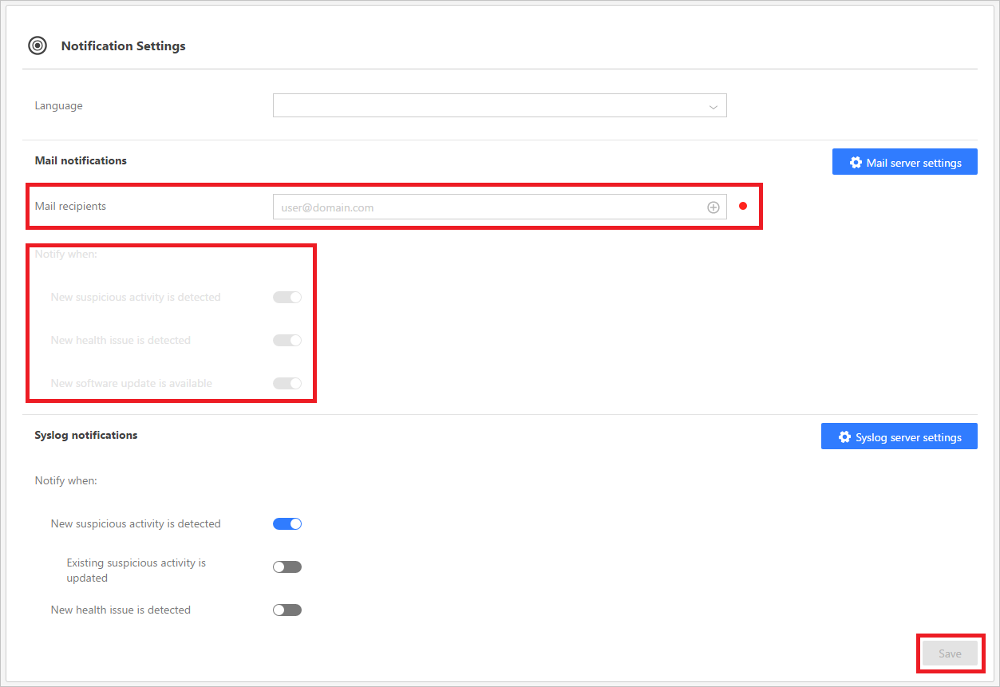

*Şunlar için geçerlidir: Advanced Threat Analytics sürüm 1.7*

# ATA Bildirimlerini Ayarlama
ATA şüpheli bir etkinlik algıladığında, e-postayla veya ATA olay iletme özelliğini kullanıp olayı SIEM/syslog sunucunuza ileterek size bildirebilir. Hangi bildirimleri almak istediğinizi seçmeden önce, [e-posta sunucunuzu ve Syslog sunucunuzu ayarlamanız](setting-syslog-email-server-settings.md) gerekir.

> [!NOTE]
> -   E-posta bildirimleri kullanıcıyı doğrudan algılanan kuşkulu etkinliğe götüren bir bağlantı içerir. Bağlantının ana bilgisayar adı bölümü ATA Center sayfasındaki ATA Konsolu URL’si ayarından alınır. Varsayılan olarak, ATA Konsolu URL’si ATA Center’ın yüklemesi sırasında seçilen IP adresidir.  E-posta bildirimlerini yapılandıracaksanız, ATA Konsolu URL’si olarak FQDN kullanmanız önerilir.
> -   Bildirimler, ATA Center’dan SMTP sunucusuna veya Syslog sunucusuna gönderilir.

## Posta bildirimleri
Posta bildirimleri almak için aşağıdaki ayarları yapın:

1. ATA Konsolu’nda, araç çubuğunda ayarlar seçeneğini belirtin ve **Yapılandırma**’yı seçin.

2. **Bildirimler** bölümü altında, **Ayarlar**’ı seçin.
3. **Posta alıcıları** altında e-posta yoluyla bildirim alacak olan alıcıları belirtin.
>   [!NOTE]
>   Kuşkulu etkinlikler için e-posta uyarıları, yalnızca kuşkulu etkinlik oluşturulduğunda gönderilir.

4. **Bildirim zamanı:** altında, hangi bildirimlerin gönderilmesi gerektiğini seçmek için iki durumlu düğmeleri kullanın:
  - Yeni şüpheli etkinlik algılandı
  - Yeni bir sistem durumu sorunu algılandı
  - Yeni yazılım güncelleştirmesi kullanıma hazır

5. **Kaydet**'e tıklayın.

## Syslog bildirimi

Syslog bildirimleri almak için aşağıdakileri ayarlayın:

1. ATA Konsolu’nda, araç çubuğunda ayarlar seçeneğini belirtin ve **Yapılandırma**’yı seçin.

2. **Bildirimler** bölümü altında, **Ayarlar**’ı seçin.
3. **Syslog bildirimleri** altında, hangi bildirimlerin gönderilmesi gerektiğini seçmek için değiştirme düğmelerini kullanın:

    - Yeni şüpheli etkinlik algılandı
    - Mevcut şüpheli etkinlik güncelleştirildi
    - Yeni bir sistem durumu sorunu algılandı
5. **Kaydet**'e tıklayın.

## Ayrıca Bkz.
[ATA forumuna bakın!](https://social.technet.microsoft.com/Forums/security/home?forum=mata)

<!--HONumber=Nov16_HO5-->

