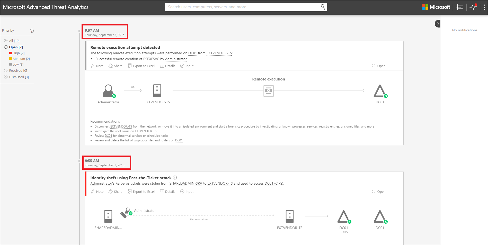

*Şunlar için geçerlidir: Advanced Threat Analytics sürüm 1.7*

# ATA Konsolu’yla çalışma

ATA tarafından algılanan kuşkulu etkinliği izlemek ve yanıtlamak için ATA Konsolu’nu kullanın.

## ATA Konsolu’na erişimi etkinleştirme
ATA Konsolunda başarıyla oturum açmak amacıyla, ATA Konsoluna erişmek için doğru ATA rolünün atandığı bir kullanıcıyla oturum açmanız gerekir. ATA’da role dayalı erişim denetimi (RBAC) hakkında daha fazla bilgi için bkz. [ATA rol gruplarıyla çalışma](ata-role-groups.md).

## ATA Konsolu’nda oturum açma

1. ATA Center sunucusunda, masaüstündeki **Microsoft ATA Konsolu** simgesine tıklayın veya tarayıcıyı açıp ATA Konsolu’na göz atın.

    

>[!NOTE]
> Ayrıca ATA Center veya ATA Gateway’den tarayıcıyı açabilir ve ATA Center yüklemesinde ATA Konsolu için yapılandırdığınız IP adresine göz atabilirsiniz.    

2.  Kullanıcı adınızla parolanızı girin ve **Oturum aç**’a tıklayın.

## ATA Konsolu

ATA Konsolu tarih sırasına göre tüm kuşkulu etkinliklerin hızlı bir görünümünü sağlar. Herhangi bir etkinliği detayına gitmenize ve bu etkinliklere dayalı olarak eylemler yapmanıza olanak tanır. Konsol ayrıca, ATA ağındaki sorunları veya kuşkulu sayılan yeni etkinlikleri vurgulamak için uyarılar ve bildirimler de görüntüler.

Bunlar ATA Konsolu’nun başlıca öğeleridir.

### Saldırı zaman çizelgesi

Bu, ATA Konsolu’nda oturum açtığınızda gittiğiniz varsayılan giriş sayfasıdır. Varsayılan olarak, tüm kuşkulu etkinliler saldırı zaman çizelgesinde gösterilir. Saldırı zaman çizelgesine filtre uygulayarak, Tüm, Açık, Çıkarılan veya Çözülen kuşkulu etkinlikleri görüntüleyebilirsiniz. Ayrıca, her etkinliğe atanmış olan önem düzeyini de görebilirsiniz.

Daha fazla bilgi için bkz. [Kuşkulu etkinliklerle çalışma](/advanced-threat-analytics/deploy-use/working-with-suspicious-activities)

### Bildirim çubuğu

Kuşkulu bir etkinlik algılandığında, bildirim çubuğu sağ tarafta otomatik olarak açılır. Son oturum açmanızdan bu yana yeni kuşkulu etkinlikler varsa, başarılı oturum açma işleminden sonra bildirim çubuğu açılır. İstediğiniz zaman sağ taraftaki oka tıklayarak bildirim çubuğunu açabilirsiniz.

### Filtreleme paneli

Kuşkulu etkinlikleri Durum ve Önem Derecesi’ne göre filtreleyerek, saldırı zaman çizelgesinde veya varlık profili kuşkulu etkinlikler sekmesinde hangi etkinliklerin görüntüleneceğini belirtebilirsiniz.

### Arama çubuğu

Üst menüde arama çubuğunu bulacaksınız. ATA’da belirli kullanıcı, bilgisayar veya grupları arayabilirsiniz. Denemek için, yazmaya başlamanız yeterlidir.

### Sistem Durumu Merkezi

Sistem Durumu Merkezi, ATA dağıtımınızda düzgün çalışmayan bir şey olduğunda size uyarılar sağlar.

Sisteminizde bağlantı hatası veya bağlantısı kesik ATA Gateway gibi herhangi bir sorunla karşılaşıldığında, Sistem Durumu Merkezi simgesi kırmızı bir nokta göstererek bu durumu öğrenmenizi sağlar. 

Sistem Durumu Merkezi uyarıları bırakılabilir veya çözülebilir ve bu uyarılar önem derecesine bağlı olarak Yüksek, Orta ve Düşük kategorilerine ayrılır. Bir uyarıyı çözerseniz ve ATA hizmeti bunu hala etkin olarak algılıyorsa, uyarı otomatik olarak Açık uyarılar listesine taşınır. Sistem artık bir uyarı için neden olmadığını (durumun düzeltildiğini) algılarsa, uyarı otomatik olarak çözülen uyarı listesine taşınır.

### Kullanıcı ve bilgisayar profilleri

ATA, ağdaki her kullanıcı ve bilgisayar için bir profil oluşturur. ATA, kullanıcı profilinde grup üyeliği, son oturum açmalar ve son erişilen kaynaklar gibi genel bilgileri görüntüler.

ATA, bilgisayar profilinde son oturum açmalar ve son erişilen kaynaklar gibi genel bilgileri görüntüler.

ATA, varlıklar (bilgisayarlar, cihazlar, kullanıcılar) hakkındaki genel bilgileri şu sayfalarda sağlar: Özet, Etkinlikler ve Kuşkulu Etkinlikler.

ATA’nın tümüyle çözümleyemediği bir profil, yanında gösterilen yarısı dolu daire simgesiyle tanımlanır.

### Mini profil

Konsolun, kullanıcı veya bilgisayar gibi tek bir varlığın bulunduğu herhangi bir yerinde, farenizi varlığın üzerine getirirseniz otomatik olarak mini profil açılır ve varsa aşağıdaki bilgileri görüntüler:

-   Ad

-   Resim

-   E-posta

-   Telefon

-   Önem derecesine göre kuşkulu etkinlik sayısı

## Ayrıca bkz.
[ATA forumuna bakın!](https://social.technet.microsoft.com/Forums/security/home?forum=mata)

<!--HONumber=Nov16_HO5-->

