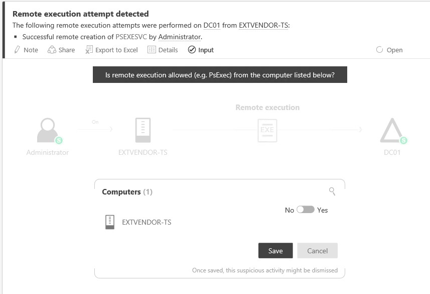

*Şunlar için geçerlidir: Advanced Threat Analytics sürüm 1.7*

# Kuşkulu Etkinliklerle Çalışma
Bu konu başlığı altında, Advanced Threat Analytics ile çalışmanın temelleri açıklanır.

## Saldırı zaman çizelgesinde kuşkulu etkinlikleri gözden geçirme
ATA Konsolu’nda oturum açtıktan sonra, otomatik olarak açık **Kuşkulu Etkinlikler Zaman Çizelgesi**’ne gelirsiniz. Kuşkulu etkinlikler, en yenileri zaman çizelgesinin en üstünde olacak şekilde kronolojik sırayla listelenir.
Her kuşkulu etkinliğin aşağıdaki bilgileri bulunur:

-   Katılan varlıklar; örneğin kullanıcılar, bilgisayarlar, sunucular, etki alanı denetleyicileri ve kaynaklar.

-   Kuşkulu etkinliklerin zamanı ve zaman çerçevesi.

-   Kuşkulu etkinliğin önem derecesi; Yüksek, Orta veya Düşük

-   Durum: Açık, çözüldü veya çıkarıldı.

-   Yapılabilecekler

    -   Kuşkulu etkinliği e-postayla kuruluşunuzdaki diğer kişilerle paylaşın.

    -   Kuşkulu etkinliği Excel’e aktarma.

    -   Kuşkulu etkinliğe bir not ekleme.

    -   Kuşkulu etkinlik için giriş sağlama.

-   Kuşkulu etkinliğin nasıl yanıtlanacağına ilişkin öneriler sağlar.

> [!NOTE]
> -   Farenizi bir kullanıcı veya bilgisayarın üzerine getirdiğinizde, varlık hakkında ek bilgi sağlayan bir varlık mini profili görüntülenir ve varlığın bağlantılı olduğu kuşkulu etkinliklerin sayısını içerir.
> -   Varlığın üzerine tıkladığınızda, kullanıcının veya bilgisayarın varlık profiline gidersiniz.

## Kuşkulu etkinlikler listesini filtreleme
Kuşkulu etkinlikler listesini filtrelemek için:

1.  Ekranın sol tarafındaki **Filtre ölçütü** bölmesinde şunlardan birini seçin: **Tümü**, **Açık**, **Çözüldü** veya **Çıkarıldı**.

2.  Listeyi daha fazla filtrelemek için, **Yüksek**, **Orta** veya **Düşük** ayarını seçin.

**Kuşkulu etkinliğin önem derecesi**

-   **Düşük**

    Kötü amaçlı kullanıcıların veya yazılımların kuruluş verilerine erişim kazanması için tasarlanmış saldırılara yol açabilecek kuşkulu etkinlikleri gösterir.

-   **Orta**

    Kimlik hırsızlığı veya ayrıcalık yükseltmeyle sonuçlanabilecek daha ciddi saldırılar için belirli kimlikleri riske atabilecek kuşkulu etkinlikleri gösterir.

-   **Yüksek**

    Kimlik hırsızlığı, ayrıcalık yükseltme ve diğer etkili saldırılara yol açabilecek kuşkulu etkinlikleri gösterir

**Kuşkulu etkinliğin durumu**

-   **Açık**

    Tüm yeni kuşkulu etkinlikler bu listede gösterilir

-   **Çözümlendi**

    Belirlediğiniz, araştırdığınız ve düzeltip etkisini azalttığınız kuşkulu etkinlikler için kullanılır.

    > [!NOTE]
    > Kısa bir süre içinde aynı etkinlik yeniden algılanırsa, ATA çözülmüş bir etkinliği yeniden açabilir.

-   **Çıkarıldı**

    Bunlar, el ile çıkardığınız etkinliklerdir. ATA benzer bir kuşkulu etkinlik algılarsa, yeni bir algılama oluşturulur.

## Kuşkulu etkinlik için giriş sağlama
ATA’nın sizinle ağınız hakkında daha fazla bilgi edinebilmesi için, ileriye dönük olarak kuşkulu etkinliklerin algılanmasını iyileştirmek amacıyla bazı kuşkulu etkinliklerde (DNS keşfi, Anahtar Geçişi, SMB Oturumu Numaralandırma, Anormal Davranış ve Uzaktan Yürütme) sizden giriş istenir.

1.  Giriş sağlamanıza olanak tanıyan kuşkulu etkinlikler için, giriş sorusu otomatik olarak açılır. Ağınızdaki etkinlikler hakkındaki soruları yanıtlamanız istenir ve bunların kuşkulu olarak kabul edilmesinin gerekip gerekmediği sorulur. Aşağıdaki örnekte, belirli bir bilgisayardan tarama araçlarının çalıştırılmasına izin verilip verilmeyeceği sorulmaktadır.

    

2.  Hayır yanıtı verirseniz, bu etkinlik kuşkulu olarak kabul edilir ve ATA herhangi bir anda bu bilgisayardan bu etkinlikle karşılaştığında uyarı alırsınız.

3.  Öte yandan evet yanıtı verirseniz, kuşkulu etkinlik çıkarılabilir ve gelecekte bu bilgisayardan bu tür etkinlikler kuşkulu etkinlik oluşturmayabilir veya otomatik olarak çıkarılan bir etkinlik oluşturabilir.

4.  Bilmiyorsanız, **İptal**’e tıklayabilirsiniz.

## Kuşkulu etkinliğin durumunu değiştirme
Kuşkulu etkinliğin geçerli durumuna tıklayıp **Açık**, **Çözüldü** veya **Çıkarıldı** ayarlarından birini seçerek, kuşkulu etkinliğin durumunu değiştirebilirsiniz.

## Ayrıca bkz.
- [ATA forumuna bakın!](https://social.technet.microsoft.com/Forums/security/home?forum=mata)
- [ATA algılama ayarlarıyla çalışma](working-with-detection-settings.md)
- [ATA yapılandırmasında değişiklik yapma](modifying-ata-configuration.md)

<!--HONumber=Jan17_HO1-->

