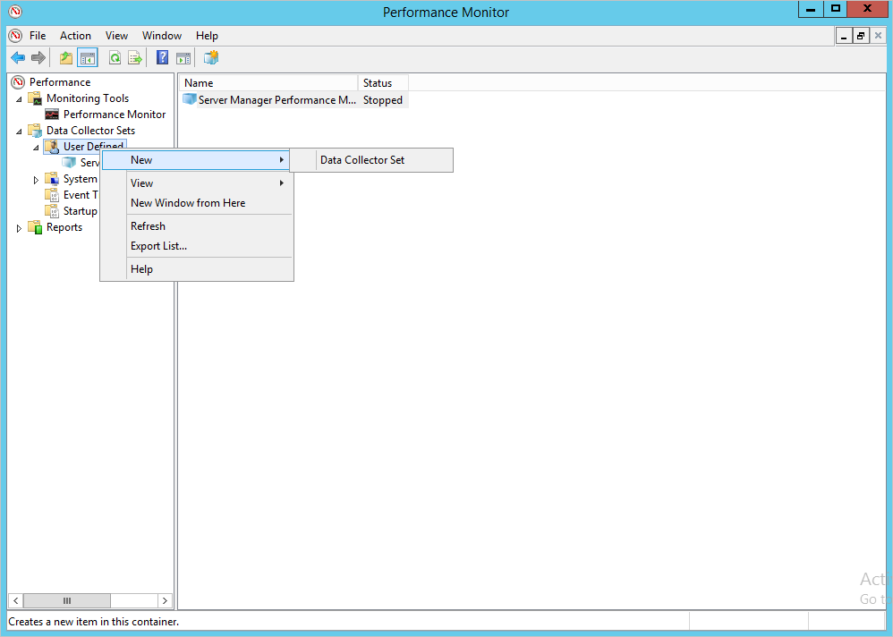

# ATA Kapasite Planlaması
Bu konu, kaç adet ATA Gateway ve/veya ATA Lightweight Gateway bileşenine ihtiyacınız olduğunu ve ATA Center ve ATA Gateway için gerekli sunucu kapasitesini anlamanın yanı sıra ağınızı görüntülemek için kaç adet ATA sunucusu gerekeceğini belirlemenize yardımcı olur.

##Boyutlandırma aracını kullanma
ATA dağıtımızın kapasitesini belirlemek için önerilen en kolay yol [ATA Boyutlandırma Aracı](http://aka.ms/atasizingtool)’nı kullanmaktır. ATA Boyutlandırma Aracı’nı çalıştırın ve Excel dosyasındaki sonuçlarda, ihtiyaç duyduğunuz ATA kapasitesini belirlemek için aşağıdaki alanları kullanın:

- ATA Center CPU ve Bellek: Sonuç dosyasındaki ATA Center tablosunda bulunan **Meşgul Paket/sn** bölümünü, [ATA Center tablosundaki](#ata-center-sizing) **SANİYE BAŞINA PAKET** bölümüyle eşleştirin.

- ATA Center Depolama: Sonuç dosyasındaki ATA Center tablosunda bulunan **Ortalama Paket/sn** bölümünü, [ATA Center tablosundaki](#ata-center-sizing) **SANİYE BAŞINA PAKET** bölümüyle eşleştirin.
- ATA Gateway: Sonuç dosyasındaki ATA Gateway tablosunda bulunan **Meşgul Paket/sn** bölümünü, [seçtiğiniz ağ geçidi türüne](#choosing-the-right-gateway-type-for-your-deployment) bağlı olarak [Ata Gateway tablosundaki](#ata-gateway-sizing) veya [ATA Lightweight Gateway tablosundaki](#ata-lightweight-gateway-sizing) **SANİYE BAŞINA PAKET** bölümüyle eşleştirin.

Çeşitli nedenlerle ATA Boyutlandırma Aracını kullanamıyorsanız, paket/sn sayaç bilgilerinizi, tüm Etki Alanı Denetleyicilerinizden 24 saat boyunca düşük toplama aralığıyla (yaklaşık 5 saniyede bir) kendiniz toplamanız gerekir. Sonrasında, her Etki Alanı Denetleyicisi için günlük ortalamanızı ve en meşgul zaman aralığı (15 dakikalık) ortalamanızı hesaplamanız gerekir.
Aşağıdaki bölüm, bir Etki Alanı Denetleyicisi’nden paket/sn sayacı bilgilerini nasıl alabileceğinizi gösteren yönergeleri içerir.

### ATA Center Boyutlandırması
Kullanıcı davranış analizi için ATA Center’a en az 30 günlük veri gerekir. Etki alanı denetleyicisi başına ATA veritabanına gereken disk alanı aşağıda tanımlanmıştır. Birden çok etki alanı denetleyiciniz varsa, ATA veritabanına gereken tüm alan miktarını hesaplamak için etki alanı denetleyicisi başına gereken disk alanlarını toplayın.
> [!NOTE] 
> Sanal makine olarak çalıştırırken dinamik bellek veya başka bir bellek balona alma özelliği desteklenmez.

|Paket/saniye&#42;|CPU (çekirdekler&#42;&#42;)|Bellek (GB)|Günlük veritabanı depolaması (GB)|Aylık veritabanı depolaması (GB)|IOPS&#42;&#42;&#42;|
|---------------------------|-------------------------|-------------------|---------------------------------|-----------------------------------|-----------------------------------|
|1.000|2|32|0.3|9|30 (100)
|10.000|4|48|3|90|200 (300)
|40.000|8|64|12|360|500 (1.000)
|100.000|12|96|30|900|1.000 (1.500)
|400.000|40|128|120|1.800|2.000 (2.500)
&#42;Tüm ATA Gateway’ler tarafından izlenen tüm etki alanı denetleyicilerinden bir saniyedeki paket sayısının toplam günlük ortalaması.

&#42;&#42;Bu fiziksel çekirdekleri içerir; hiper iş parçacıklı çekirdekleri içermez.

&#42;&#42;&#42;Ortalama sayılar (En yüksek sayılar)
> [!NOTE]
> -   ATA Center, tüm izlenen etki alanı denetleyicilerinden saniyede toplam en çok 400.000 çerçeveyi (FPS) işleyebilir.
> -   Burada belirtilen depolama miktarları net değerlerdir, gelecekteki büyümeyi de hesaba katmalı ve üzerinde veritabanının bulunduğu diskte en az %20 boş alan bulunduğundan emin olmalısınız.
> -   Boş alanınız en az %20’ye veya 100 GB’a ulaşırsa, en eski veri koleksiyonu silinir. Bu işlem, yalnızca iki günlük veri kalana ya da boş alan %5 veya 50 GB’a inene kadar devam eder; bu noktaya ulaşıldığında veri koleksiyonu çalışmayı durdurur.
> -  Okuma ve yazma etkinlikleri için depolama gecikmesi 10 ms’nin altında olmalıdır.
> -  Okuma ve yazma etkinlikleri arasındaki oran, saniyede 100.000 paketin altında yaklaşık 1:3 ve saniyede 100.000 paketin üstünde 1:6’dır.

## Dağıtımınız için doğru ağ geçidi türünü seçme
ATA dağıtımında, ATA Gateway türlerinin tüm bileşimleri desteklenir:

- Yalnızca ATA Gateway bileşenleri
- Yalnızca ATA Lightweight Gateway bileşenleri
- Her ikisinin birleşimi

Ağ Geçidi dağıtım türüne karar verirken aşağıdakileri göz önünde bulundurun:

|Ağ Geçidi türü|Yararları|Maliyet|Dağıtım topolojisi|Etki alanı denetleyicisi kullanımı|
|----|----|----|----|-----|
|ATA Gateway|Bant dışı dağıtım, saldırganların ATA’nın var olduğunu keşfetmesini zorlaştırır|Daha yüksek|Etki alanı denetleyicisinin yanı sıra yüklenir (bant dışı)|Saniyede en çok 50.000 paketi destekler|
|ATA Lightweight Gateway|Ayrılmış bir sunucu ve bağlantı noktası yansıtma yapılandırması gerektirmez|Daha düşük|Etki alanı denetleyicisine yüklenir|Saniyede en çok 10.000 paketi destekler|

Aşağıda, etki alanı denetleyicilerinin ATA Lightweight Gateway kapsamında olmasının gerektiği örnek senaryolar verilmiştir:

- Şube yerleri

- Bulutta dağıtılan sanam etki alanı denetleyicileri (IaaS)

Aşağıda, etki alanı denetleyicilerinin ATA Gateway kapsamında olmasının gerektiği örnek senaryolar verilmiştir:

- Yönetim veri merkezleri (saniyedeki paket sayısı 10.000’i aşan etki alanı denetleyicilerine sahip)

### ATA Lightweight Gateway Boyutu

Bir ATA Lightweight Gateway, etki alanı denetleyicisinin oluşturduğu ağ trafiği miktarına bağlı olarak bir etki alanı denetleyicisinin izlenmesini destekleyebilir. 
> [!NOTE] 
> Sanal makine olarak çalıştırırken dinamik bellek veya başka bir bellek balona alma özelliği desteklenmez.

|Paket/saniye&#42;|CPU (çekirdekler&#42;&#42;)|Bellek (GB)&#42;&#42;&#42;|
|---------------------------|-------------------------|---------------|
|1.000|2|6|
|5,000|6|16|
    |10.000|10|24|

&#42;Belirli bir ATA Lightweight Gateway tarafından izlenen etki alanı denetleyicilerinde bir saniyedeki paket sayısının toplamı.

&#42;&#42;Bu etki alanı denetleyicisinde takılı hiper iş parçacıklı olmayan çekirdeklerin toplamı. Hiper iş parçacığı oluşturma ATA Lightweight Gateway için kabul edilebilir olmakla birlikte, kapasite planlaması yaparken hiper iş parçacıklı çekirdekleri değil gerçek çekirdekleri saymanız gerekir.

&#42;&#42;&#42;Bu etki alanı denetleyicisinde takılı belleğin toplam miktarı.
> [!NOTE]   
> Etki alanı denetleyicisinde, ATA Lightweight Gateway için gereken miktarda kaynak yoksa, etki alanı denetleyicisi performansı etkilenmez, ancak ATA Lightweight Gateway beklendiği gibi çalışmayabilir.

### ATA Gateway Boyutlandırması

Kaç adet ATA Gateway bileşeninin dağıtımını yapacağınıza karar verirken aşağıdaki noktaları dikkate alın.

-   **Active Directory ormanları ve etki alanları** 
    ATA tek bir Active Directory ormanındaki birden çok etki alanından trafiği izleyebilir. Birden çok Active Directory ormanını izlemek için ayrı ATA dağıtımları gerekir. Tek bir ATA dağıtımı farklı ormanlardaki etki alanı denetleyicilerinin ağ trafiğini izlemek için yapılandırılmamalıdır.

-   **Bağlantı Noktası Yansıtma** 
Bağlantı noktası yansıtmayla ilgili önemli noktalar, her bir veri merkezi veya şube için birden fazla ATA Gateway bileşeni yapılandırmanızı gerektirebilir.

-   **Kapasite** 
    ATA Gateway, izlenmekte olan etki alanı denetleyicilerinin ağ trafiği miktarına bağlı olarak, birden çok etki alanı denetleyicisinin izlenmesini destekleyebilir. 
 

> [!NOTE] 
> Dinamik bellek desteklenmez.

|Paket/saniye&#42;|CPU (çekirdekler&#42;&#42;)|Bellek (GB)|
|---------------------------|-------------------------|---------------|
|1.000|1|6|
|5,000|2|10|
|10.000|3|12|
|20,000|6|24|
|50.000|16|48|
&#42;Günün en yoğun saatinde belirli bir ATA Gateway tarafından izlenen tüm etki alanı denetleyicilerinden bir saniyedeki ortalama paket sayısının toplamı.

&#42;Etki alanı denetleyicisi bağlantı noktası yansıtmalı trafiğinin toplam miktarı, ATA Gateway’deki yakalama NIC’in kapasitesini aşamaz.

&#42;&#42;Hiper iş parçacığı devre dışı bırakılmalıdır.

## Etki alanı denetleyicisi tahmini trafiği
Etki alanı denetleyicilerinizin saniyedeki ortalama paket sayısını bulmak için kullanabileceğiniz çeşitli araçlar vardır. Bu sayacı izleyen hiçbir aracınız yoksa, gerekli bilgileri toplamak için Performans İzleyicisi’ni kullanabilirsiniz.

Saniyedeki paket sayısını belirlemek için, her etki alanı denetleyicisinde aşağıdakileri yapın:

1.  Performans İzleyicisi'ni açın.

    

2.  **Veri Toplayıcı Kümeleri**’ni genişletin.

    

3.  **Kullanıcı Tanımlı**’ya sağ tıklayın ve **Yeni** &gt; **Veri Toplayıcı Kümesi**’ni seçin.

    

4.  Toplayıcı kümesi için bir ad girin ve **El İle Oluştur (Gelişmiş)** öğesini seçin.

5.  **Hangi veri türlerini eklemek istersiniz?** alanında **Veri günlüklerini ve performans sayacını oluştur**’u seçin.

    

6.  **Hangi performans sayaçlarını günlüğe kaydetmek istersiniz?** alanında **Ekle**’ye tıklayın.

7.  **Ağ Bağdaştırıcısı**’nı genişletin, **Paket/sn**’yi seçin ve doğru örneği seçin. Emin değilseniz, **&lt;Tüm örnekler&gt;**’i seçebilir, ardından **Ekle**’ye ve **Tamam**’a tıklayabilirsiniz.

    > [!NOTE]
    > Bunu yapmak için, komut satırında `ipconfig /all` komutunu çalıştırarak bağdaştırıcının ve yapılandırmanın adını görüntüleyin.

    

8.  **Örnek aralığı** değerini **1 saniye** olarak değiştirin.

9. Verilerin kaydedilmesini istediğiniz konumunu ayarlayın.

10. **Veri toplayıcı kümesi oluştur**’un altında **Bu veri toplayıcı kümesini şimdi başlat**’ı seçin ve **Son**’a tıklayın.

    Şimdi yeni oluşturduğunuz veri toplayıcı kümesini, çalıştığını gösteren yeşil üçgenle birlikte görüyor olmalısınız.

11. 24 saat sonra, veri toplayıcı kümesine sağ tıklayıp **Durdur**’u seçerek veri toplayıcı kümesini durdurun.

    

12. Dosya Gezgini’nde, .blg dosyasının kaydedildiği klasöre göz atın ve dosyayı çift tıklayarak Performans İzleyicisi’nde açın.

13. Paket/sn sayacını seçin, ortalama ve en yüksek değerleri kaydedin.

    

## Ayrıca Bkz.
- [ATA önkoşulları](ata-prerequisites.md)
- [ATA mimarisi](ata-architecture.md)
- [ATA forumuna bakın!](https://social.technet.microsoft.com/Forums/security/home?forum=mata)

<!--HONumber=Jul16_HO4-->

