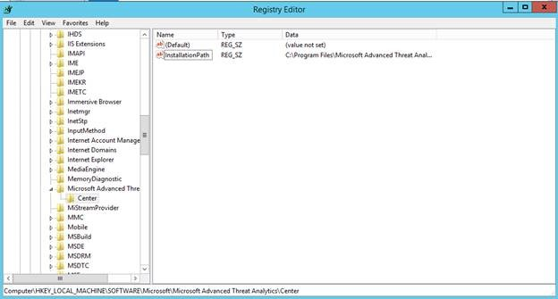

# ATA sürüm 1.4’teki yenilikler
Bu sürüm notları, Advanced Threat Analytics sürüm 1.4’teki bilinen sorunlar hakkında bilgi sağlar.

## Bu sürümdeki yenilikler

-   Olayları doğrudan etki alanı denetleyicilerinden ATA Gateway’e göndermek için Windows Olay İletme (WEF) desteği.

-   DPI (Derin Paket İncelemesi) ve Windows olay günlüklerini birleştirerek şirket kaynaklarında Karma Değer Geçişi algılama iyileştirmeleri.

-   Etki alanına katılmayan cihazlarda ve Windows olmayan cihazlarda algılama ve görünürlük desteğinde iyileştirmeler.

-   ATA Gateway başına daha fazla trafiği desteklemeye yönelik performans geliştirmeleri.

-   ATA Center başına daha fazla ATA Gateway desteklemeye yönelik performans geliştirmeleri.

-   Bilgisayar adlarıyla IP adreslerini eşleştiren yeni bir otomatik ad çözümleme işlemi eklendi; bu benzersiz özellik araştırma sürecinde çok değerli bir zaman tasarrufu getirecek ve güvenlik analistleri için güçlü kanıtlar sağlayacak

-   Algılama sürecini otomatik olarak ayarlamak için kullanıcılardan geliştirilmiş giriş toplama özelliği.

-   NAT cihazları için otomatik algılama.

-   Etki alanı denetleyicileri erişilemez durumda olduğunda otomatik yük devretme.

-   Sistem durumunu izleme işlemi ve bildirimler artık hem dağıtımın genel durumunu hem de yapılandırma ve bağlantıyla ilgili özel sorunları sağlar.

-   Varlıkların üzerinde çalıştığı sitelerde ve konumlarda görünürlük.

-   Birden çok etki alanı desteği.

-   Tek Etiketli Etki Alanları (SLD) desteği.

-   ATA Gateway’lerin ve ATA Center’ın IP adresini ve sertifikasını değiştirme desteği.

-   Müşteri deneyimini geliştirmeye yardımcı olmak için telemetri.

## Bilinen sorunlar
Bu sürümün bilinen sorunları şunlardır:

### Ağ Yakalama Yazılımı
ATA Gateway’de, yükleyebileceğiniz desteklenen tek ağ yakalama yazılımı [Microsoft Network Monitor 3.4](http://www.microsoft.com/download/details.aspx?id=4865)’tür. Microsoft Message Analyzer’ı veya başka bir ağ yakalama yazılımını yüklemeyin. Başka bir yazılımın yüklenmesi ATA Gateway’in düzgün çalışmayı durdurmasına neden olur.

### Zip dosyasından yükleme
ATA Gateway’i yüklerken, dosyaları zip dosyasından bir yerel dizine ayıkladığınızdan emin olun ve bileşeni o dizinden yükleyin. ATA Gateway’i doğrudan zip dosyasının içinden yüklemeyin; yoksa yükleme başarısız olur.

### ATA’nın önceki sürümlerini kaldırma
ATA’nın önceki bir sürümünü, Public Preview veya Private Preview sürümlerini yüklediyseniz, ATA’nın bu sürümünü yüklemeden önce ATA Center ve ATA Gateway bileşenlerini kaldırmalısınız.

Ayrıca, Veritabanı dosyalarını ve günlük dosyalarını da silmeniz gerekir. Önce ATA sürümlerinden gelen veritabanları, ATA’nın GA sürümüyle uyumlu değildir.

ATA Center veya ATA Gateway’i kaldırmaya çalıştığınızda, kaldırma yerine ATA yüklemesi açılıyorsa, aşağıdaki kayıt defteri anahtarını eklemeli ve ardından ATA’yı yeniden kaldırmalısınız.

**ATA Center**

-   HKLM\SOFTWARE\Microsoft\Microsoft Advanced Threat Analytics\Center

-   Adı `InstallationPath` ve değeri `C:\Program Files\Microsoft Advanced Threat Analytics\Center` olan yeni bir Dize değeri ekleyin. Bu, varsayılan yükleme klasörüdür. Yükleme klasörünü değiştirdiyseniz, ATA’nın yüklendiği yolu girin.

    

**ATA Gateway**

-   HKLM\SOFTWARE\Microsoft\Microsoft Advanced Threat Analytics\Gateway

-   Adı `InstallationPath` ve değeri `C:\Program Files\Microsoft Advanced Threat Analytics\Gateway` olan yeni bir Dize değeri ekleyin. Bu, varsayılan yükleme klasörüdür.  Yükleme klasörünü değiştirdiyseniz, ATA’nın yüklendiği yolu girin.

    

Kaldırma işleminden sonra, hem ATA Center hem de ATA Gateway’deki yükleme klasörünü silin.  Veritabanını ayrı bir klasöre yüklediyseniz, ATA Center’da Veritabanı klasörünü silin.

### Sistem durumu uyarısı - bağlantısı kesilmiş ATA Gateway
Birden çok ATA Gateway bileşeniniz varsa ve Bağlantısı Kesilmiş ATA Gateway uyarıları alıyorsanız, otomatik çözüm bileşenlerden yalnızca birinde çalışır ve diğer bileşenler Açık durumda kalır. ATA Gateway’in açık olduğunu, hizmetin çalıştığını el ile onaylamalı ve uyarıyı el ile çözmelisiniz.

### Sanallaştırma ana bilgisayarında KB
Sanallaştırma ana bilgisayarına KB 3047154’ü yüklemeyin. Bu, bağlantı noktası yansıtma işleminin düzgün çalışmayı durdurmasına neden olur.

## Ayrıca bkz.

[ATA’yı 1.6 sürümüne güncelleştirme: geçiş kılavuzu](ata-update-1.6-migration-guide.md)

[ATA forumuna bakın!](https://social.technet.microsoft.com/Forums/security/home?forum=mata)