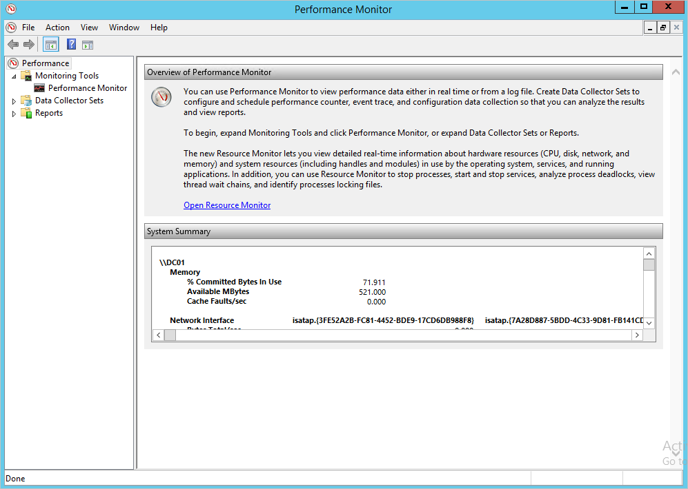

*Uygulandığı öğe: Azure Gelişmiş tehdit koruması*

# Azure ATP kapasite planlaması
Bu makalede kaç Azure ATP algılayıcılar ve ihtiyacınız olan tek başına algılayıcılar belirlemenize yardımcı olur.

> [!NOTE] 
> İki sayfa - boyutlandırma aracı olan ATA, diğeri Azure ATP için için. Doğru sayfasında olduğundan emin olun.

## Boyutlandırma aracını kullanma
Azure ATP dağıtımınızı kullanmaktır kapasitesini belirlemek için önerilen en kolay yol [Azure ATP boyutlandırma aracı](http://aka.ms/aatpsizingtool). Azure ATP boyutlandırma aracını çalıştırın ve Excel dosyasındaki sonuçlarda, CPU ve bellek belirlemek için aşağıdaki alanları kullanın algılayıcı tarafından kullanılan:

- Azure ATP algılayıcı: eşleşme **meşgul Paket/sn** sonuçları dosyasında Azure ATP algılayıcı tablosundaki **başına paket ikinci** alanındaki [Azure ATP tek başına algılayıcı tablo](#azure-atp-sensor-sizing)veya [Azure ATP algılayıcı tablo](#azure-atp-standalone-sensor-sizing)bağlı olarak [seçtiğiniz algılayıcı türü](#choosing-the-right-sensor-type-for-your-deployment).

El ile herhangi bir nedenden dolayı Azure ATP boyutlandırma aracını kullanamıyorsanız, Paket/sn sayaç bilgilerinizi düşük toplama aralığıyla (yaklaşık 5 saniye) ile 24 saat için tüm etki alanı denetleyicilerinden toplayın. Sonrasında, her Etki Alanı Denetleyicisi için günlük ortalamanızı ve en meşgul zaman aralığı (15 dakikalık) ortalamanızı hesaplamanız gerekir.
Aşağıdaki bölüm, bir Etki Alanı Denetleyicisi’nden paket/sn sayacı bilgilerini nasıl alabileceğinizi gösteren yönergeleri içerir.

## Dağıtımınız için doğru algılayıcı türü seçme
Bir Azure ATP dağıtımdaki herhangi bir bileşimini Azure ATP tek başına algılayıcı türleri desteklenir:

- Yalnızca Azure ATP tek başına algılayıcılar
- Yalnızca Azure ATP algılayıcısı
- Her ikisinin birleşimi

Algılayıcı dağıtım türüne karar verirken aşağıdaki yararları göz önünde bulundurun:

|algılayıcı türü|Yararları|Maliyet|Dağıtım topolojisi|Etki alanı denetleyicisi kullanımı|
|----|----|----|----|-----|
|Azure ATP tek başına algılayıcısı|Bant dışı dağıtım, saldırganların Azure ATP var olduğunu keşfetmesini zorlaştırır|Daha yüksek|Etki alanı denetleyicisinin yanı sıra yüklenir (bant dışı)|Saniye başına en fazla 100.000 paketi destekler|
|Azure ATP algılayıcısı|Ayrılmış bir sunucu ve bağlantı noktası yansıtma yapılandırması gerektirmez|Daha düşük|Etki alanı denetleyicisine yüklenir|Saniye başına en fazla 100.000 paketi destekler|

Aşağıdaki sorunlar dağıtmak için kaç tane Azure ATP tek başına algılayıcılar karar verirken göz önünde bulundurun.

-   **Active Directory ormanları ve etki alanları** 
    Azure ATP oluşturduğunuz her çalışma alanı için tek bir Active Directory ormanındaki birden çok etki alanından trafiği izleyebilir. Birden çok orman izlemek için birden çok çalışma oluşturmanız gerekir. 

-   **Bağlantı Noktası Yansıtma** 
Bağlantı noktası yansıtmayla veri merkezi veya şube site başına birden çok Azure ATP tek başına algılayıcılar dağıtmak gerektirebilir.

-   **Kapasite** 
    Bir Azure ATP tek başına algılayıcı, izlenmekte olan etki alanı denetleyicilerinin ağ trafiği miktarına bağlı olarak, birden çok etki alanı denetleyicisinin izlenmesini destekleyebilir. 

## Azure ATP algılayıcı ve tek başına algılayıcı boyutlandırma 

Bir Azure ATP algılayıcı, etki alanı denetleyicisinin oluşturduğu ağ trafiği miktarına bağlı bir etki alanı denetleyicisinin izlenmesini destekleyebilir. Aşağıdaki tabloda bir tahmindir, algılayıcı ayrıştırır son tutarını trafiği ve trafiğinin dağıtımını miktarına bağlıdır. 
> [!NOTE]
> Aşağıdaki CPU ve bellek kapasitesini algılayıcının kendi tüketim – etki alanı denetleyicisi kapasitesi başvuruyor.

|Saniye başına paket *|CPU (çekirdekler)|Bellek (GB)|
|----|----|-----|
|0-1k|0.25|2.50|
|1k-5k|0.75|6.00|
|5k-10k|1.00|6.50|
|20 10k - k|2.00|9.00|
|50 20k - k|3.50|9.50|
|50k-75k |3.50|9.50|
|100 75k - k|3.50 |9.50|

> [!NOTE]
> - Algılayıcı hizmetini kullanacak olan çekirdek toplam sayısı. Hiper iş parçacıklı çekirdekleri ile çalışmıyor önerilir.
> - Algılayıcı hizmetini kullanacak olan bellek toplam miktarı.
> -   Etki alanı denetleyicisi Azure ATP algılayıcı tarafından gereken kaynakları yoksa, etki alanı denetleyicisi performansı etkilenmez, ancak Azure ATP algılayıcı beklendiği gibi çalışmayabilir.
> -   Sanal makine olarak çalıştırırken dinamik bellek veya başka bir bellek balona alma özelliği desteklenmez.
> -   En iyi performans için ayarlanmış **güç seçeneği** Azure ATP algılayıcı **yüksek performanslı**.
> -   En az 2 Çekirdek ve 6 GB alanı gereklidir ve Azure ATP ikili dosyaları ve günlükleri için gereken alanı dahil olmak üzere 10 GB önerilir.

## Etki alanı denetleyicisi tahmini trafiği

Etki alanı denetleyicilerinizin saniyedeki ortalama paket sayısını bulmak için kullanabileceğiniz çeşitli araçlar vardır. Bu sayacı izleyen hiçbir aracınız yoksa, gerekli bilgileri toplamak için Performans İzleyicisi’ni kullanabilirsiniz.

Paket/saniye oranını belirlemek için her etki alanı denetleyicisinde aşağıdakileri adımları yerine getirin:

1.  Performans İzleyicisi'ni açın.

    

2.  **Veri Toplayıcı Kümeleri**’ni genişletin.

    

3.  **Kullanıcı Tanımlı**’ya sağ tıklayın ve **Yeni** &gt; **Veri Toplayıcı Kümesi**’ni seçin.

    

4.  Toplayıcı kümesi için bir ad girin ve **El İle Oluştur (Gelişmiş)** öğesini seçin.

5.  **Hangi veri türlerini eklemek istersiniz?** alanında **Veri günlükleri ve Performans sayacını oluştur**’u seçin.

    

6.  **Hangi performans sayaçlarını günlüğe kaydetmek istersiniz?** alanında **Ekle**’ye tıklayın.

7.  **Ağ Bağdaştırıcısı**’nı genişletin, **Paket/sn**’yi seçin ve doğru örneği seçin. Emin değilseniz, **&lt;Tüm örnekler&gt;**’i seçebilir, ardından **Ekle**’ye ve **Tamam**’a tıklayabilirsiniz.

    > [!NOTE]
    > Bunu bir komut satırında yapmak için `ipconfig /all` komutunu çalıştırarak bağdaştırıcının ve yapılandırmanın adını görüntüleyin.

    

8.  Değişiklik **örnekleme aralığı** için **beş saniyede**.

9. Verilerin kaydedilmesini istediğiniz konumunu ayarlayın.

10. Altında **veri toplayıcı kümesi oluştur**seçin **bu veri toplayıcı kümesini Şimdi Başlat**, tıklatıp **son**.

    Artık oluşturduğunuz veri toplayıcı kümesini ve kümenin çalıştığını gösteren yeşil üçgeni görebilirsiniz.

11. 24 saat sonra, veri toplayıcı kümesine sağ tıklayıp **Durdur**’u seçerek veri toplayıcı kümesini durdurun.

    

12. Dosya Gezgini’nde, .blg dosyasının kaydedildiği klasöre gözatın ve çift tıklayarak dosyayı Performans İzleyicisi’nde açın.

13. Paket/sn sayacını seçin, ortalama ve en yüksek değerleri kaydedin.

    

## Ayrıca bkz:
- [Azure ATP boyutlandırma aracı](http://aka.ms/aatpsizingtool)
- [Azure ATP önkoşulları](atp-prerequisites.md)
- [Azure ATP mimarisi](atp-architecture.md)
- [ATP forumuna bakın!](https://aka.ms/azureatpcommunity)
